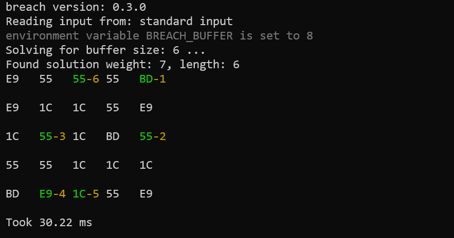
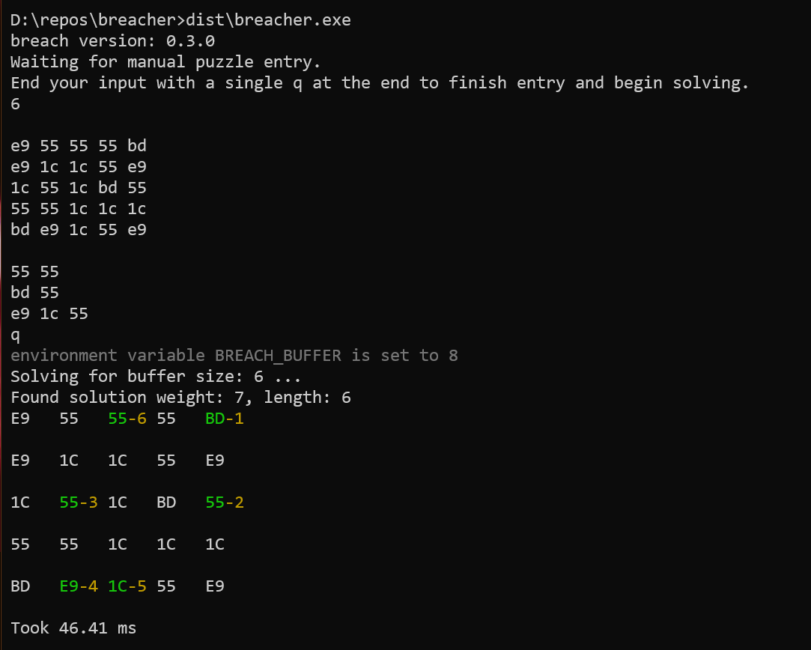
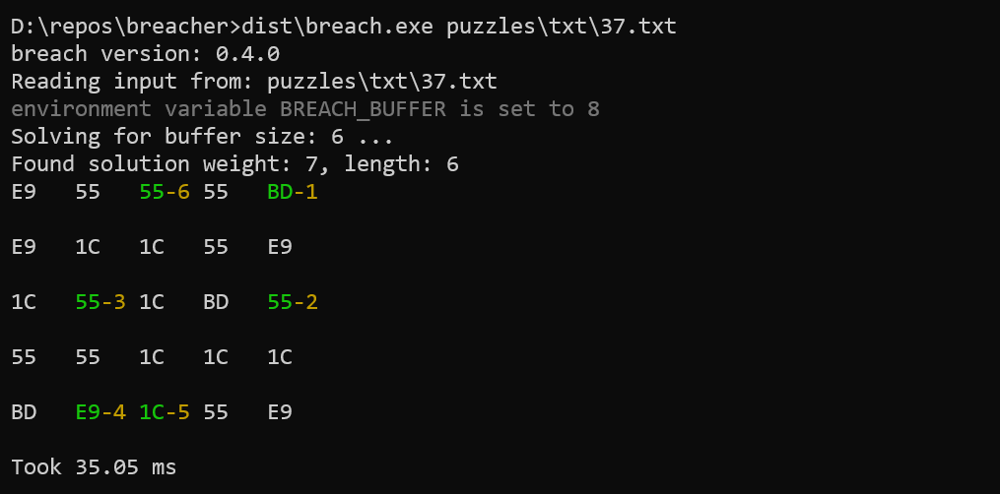
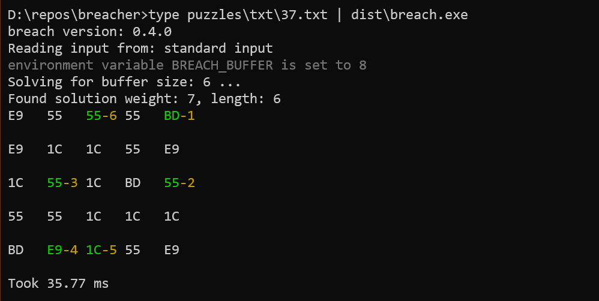

# `breach`
A puzzle solver for the [Cyberpunk 2077 breach minigame](https://www.rockpapershotgun.com/2020/12/14/cyberpunk-2077-hacking-minigame-breach-protocol-explained/).

[](https://github.com/kyle-rader/breach/actions?query=workflow%3A%22Dotnet+Test%22)
[](https://www.nuget.org/packages/breach/)

This puzzle solver require you give the input in the format detailed below and will print the best possible solution in matrix format.

**Example output** (From [puzzle 37](./puzzles/txt/37.txt))



# Install with `dotnet`
1. [Install the dotnet CLI (.NET SDK 5.0.101)](https://dotnet.microsoft.com/download/dotnet/5.0)
2. Install with `dotnet`
   ```
   dotnet tool install --global breach
   ```
   which installs from https://www.nuget.org/packages/breach/.

   After installing you can just run `breach`. The screen shots below use `dist\breach.exe` since I was running the locally built executable.

3. You can update to new releases via
   ```
   dotnet tool update --global breach
   ```

# Using the tool

## Manual entry on the cli
Enter input **manually** by running the program with no arguments. e.g.



## Input File
Enter input **with an input file**. The input file _should not have_ a `q` at the end.



## Piping from `stdin`
Enter input by **pipeing from stdin**. The input file _should not have_ a `q` at the end.



(The `|` (vertical bar) is what we call the _pipe_ operator.)

# Puzzle Input Format

```html
<buffer-size: single digit>
<blank-line>
<puzzle: one row per line>
<blank-line>
<targets: one per line>
```

## Set buffer size with an `BREACH_BUFFER`
You can use set your buffer size with the env var `BREACH_BUFFER` so you don't have to input it every time.

_Note that running these commands in your terminal only sets them for that terminal session. A new terminal will not have them set._

**Windows**
```
set BREACH_BUFFER=6
```

**OSX / Linux**
```
export BREACH_BUFFER=6
```

For examples see the [demo puzzles](./puzzles/txt/).

Puzzle [`txt/01.txt`](./puzzles/txt/01.txt) is:
```
7

1c 55 ff bd e9
bd 1c e9 ff e9
55 bd ff 1c 1c
e9 bd 1c 55 55
55 e9 bd 55 ff

e9 55
55 bd e9
ff 1c bd e9
55 1c ff 55
```

# Run/build from source
1. [Install the dotnet CLI (.NET SDK 5.0.101)](https://dotnet.microsoft.com/download/dotnet/5.0)
2. [Install Git](https://git-scm.com/) for your operating system.
3. [Open a terminal](https://www.google.com/search?rlz=1C1GCEA_enUS911US911&sxsrf=ALeKk01gg9j9o5joiNmR79cQ3YfaJC61Jw%3A1608280570266&ei=-mncX4fVD9fL-gSu4bKgBw&q=how+to+open+a+terminal&oq=how+to+open+a+terminal&gs_lcp=CgZwc3ktYWIQAzIECCMQJzIKCAAQyQMQFBCHAjICCAAyAggAMgIIADICCAAyAggAMgIIADICCAAyAggAOgQIABBHOggIABCxAxCDAToLCC4QsQMQxwEQowI6BAguEEM6BQgAELEDOgQIABBDOggILhCxAxCDAToHCAAQyQMQQzoCCC46CAgAEMkDEJECOgUIABCRAjoHCAAQFBCHAlDOYFidcmDndWgAcAJ4AYABUIgBygiSAQIyMpgBAKABAaoBB2d3cy13aXrIAQjAAQE&sclient=psy-ab&ved=0ahUKEwiHutuAkNftAhXXpZ4KHa6wDHQQ4dUDCA0&uact=5) and clone this repo.
   ```
   git clone https://github.com/kyle-rader/breach.git
   ```
4. `cd` into the repo.
5. Compile the program
   ```
   publish.cmd
   ```
   This will make a folder called `dist` in which you will find the self-contained executable.
   You can then run it via
   ```
   dist\breach.exe
   ```

# Future Work
* Print the solution visually to make it easier to follow.
* Build GUI to allow pasting screen shots and parse puzzle input using ML for ultimate laziness.

# Closing Notes
I found this to be one of the more interesting mini game puzzles in a video game. Programming a solution was simply out of interest and for fun to check myself. The mini-game is to emulate "hacking" so I don't feel bad about actually "hacking" the game ;)

Suggestions welcome. Feel free to open a pull request!
